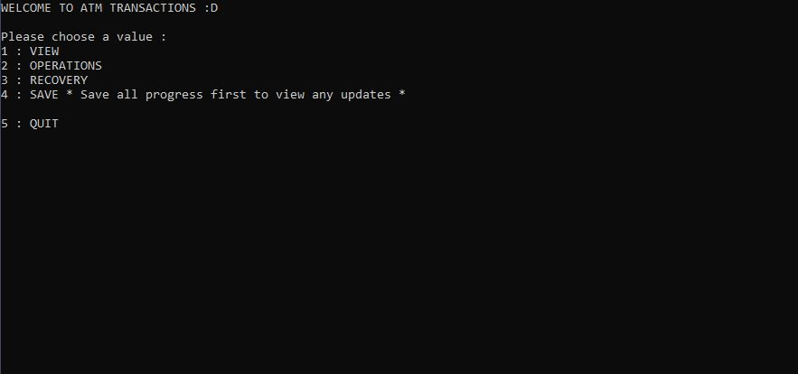

# Atm
Implementation/Emulation of data storage and recovery options provided by a database management system.

# NOTE
This code runs on GNU's g++ compiler on ubuntu.
To run this on Windows make sure you install the appropriate compiler and have the neccessary file permissions enabled.
Reccomended : run this on a Linux distro :p

